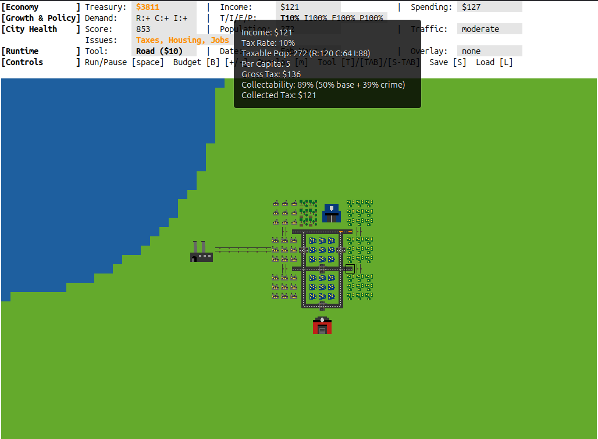
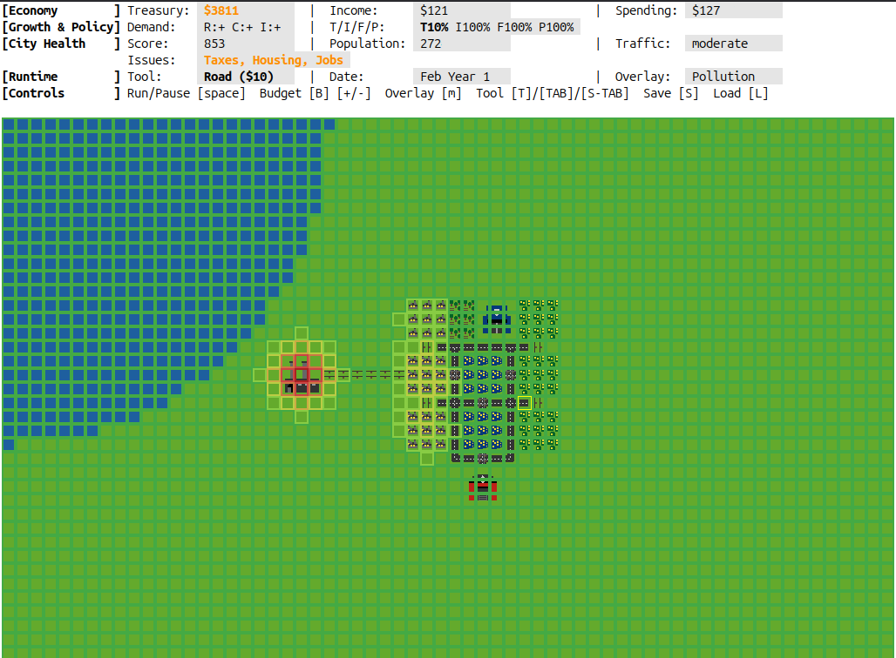
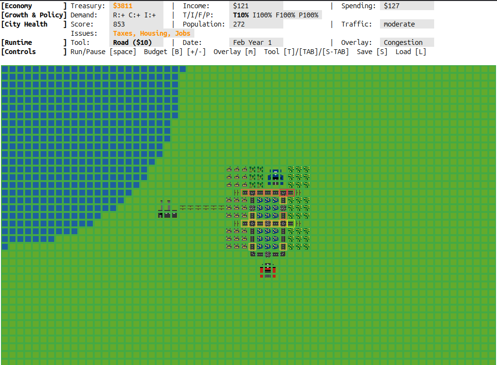

#+title: ElCity

ElCity is a minimal city-building simulation game for Emacs. You build roads, zone
residential/commercial/industrial areas, place utility buildings (power plants,
fire/police stations, parks), all from the comfort of everybody's favourite Lisp machine.

Those interested in the whys and hows of the project, there's a [[file:HISTORY.org][HISTORY.org]] with the
details of how it came to be.

* Systems Implemented

All the classic moving parts are here:

- Pollution
- Crime
- R/C/I demand
- Fire risk
- Police coverage
- Traffic congestion

The overall balance might feel off at times.

HINT: cycle map overlays with =m= to see each system's effects. The status panel also has
contextual tooltips.

* More Than a Thousand Words

#+CAPTION: A growing city core.

#+CAPTION: Pollution overlay in action.

#+CAPTION: Congestion building up on busy routes.

* Controls
The cursor marks the active tile. Select a tool, move to a tile, then place with
=RET= or mouse click.

** Building Tool Selection
- =r=: road
- =p=: powerline
- =R=: residential zone (3x3)
- =C=: commercial zone (3x3)
- =I=: industrial zone (3x3)
- =c=: coal plant (3x3)
- =n=: nuclear plant (4x4)
- =f=: fire station (3x3)
- =o=: police station (3x3)
- =k=: park
- =b=: bulldoze
- =i=: inspect tile
- =TAB= or =T=: next tool
- =S-TAB= (backtab): previous tool

** Placement and Inspection
- =RET=: place selected tool (or inspect in inspect mode)
- left mouse down (=down-mouse-1=): place selected tool at clicked tile

** Movement
- Arrow keys or =C-f C-b C-n C-p=: move one tile
- =C-a= or =Home=: jump to first tile in current row
- =C-e= or =End=: jump to last tile in current row

** Simulation and Overlays
- =SPC=: play/pause simulation
- =.=: advance one tick (single-step)
- =m=: cycle map overlay

** Budget, Save/Load, and Session
- =B=: cycle budget control (tax/infrastructure/fire/police)
- =+= or ===: increase selected budget control
- =-=: decrease selected budget control
- =S=: save game
- =L=: load game
- =u=: undo last placement (up to 3)
- =q=: quit

* Running the Game

Needs:

- Emacs 30.1 or newer
- Emacs GUI mode
- GNU Make

For real play, compile first; the uncompiled engine is too slow.
I only tested this in graphical Emacs on GNU/Linux.

#+begin_src bash
make compile run
#+end_src

This opens the ElCity UI with simulation starts paused.
